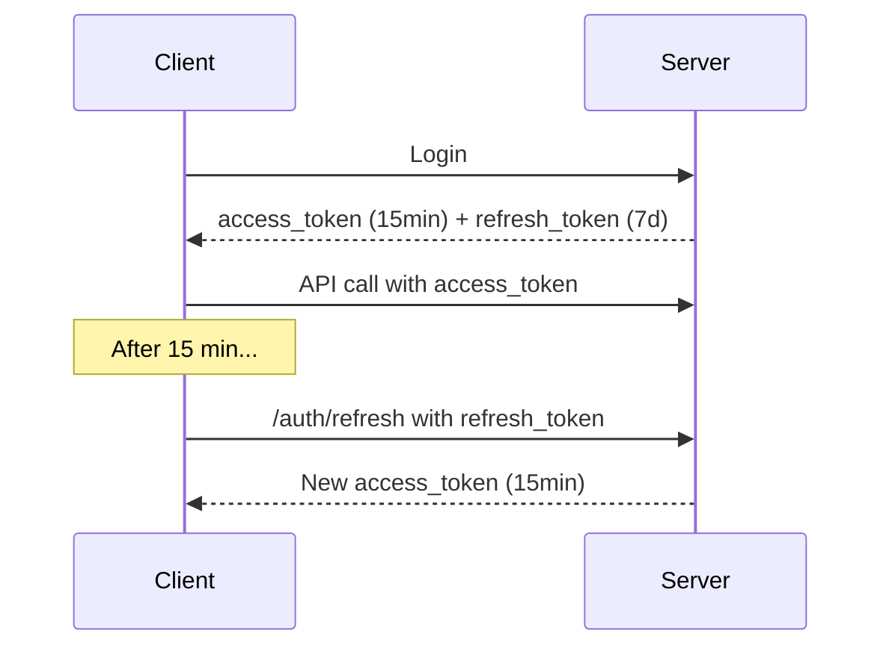

# 🔍 Expert Architecture Audit — AI Job Automation Platform

A comprehensive, no-holds-barred review of every layer of your system, from an expert who has built production job application platforms.

---

## Executive Summary

Your platform has a **strong foundation** — the core flow (resume upload → AI extraction → job scraping → Playwright auto-apply) works end-to-end. The Playwright automation service is genuinely impressive with its multi-strategy form filling and step detection.

However, there are **10 critical areas** where improvements would take this from a prototype to a production-grade system. I've ordered them by severity.

---

## 🔴 1. SECURITY — Critical Issues

### 1a. API Keys Exposed in `.env` (CRITICAL)

Your [.env](file:///d:/automation/Job%20Applied/backend/.env) file contains **real API keys** for OpenRouter, Groq, RapidAPI, and TinyFish. If this repo has ever been pushed to GitHub, **all these keys are compromised**.

```diff
# These are LIVE keys visible in your .env:
- OPENAI_API_KEY=sk-or-v1-31a31e42ca835a...
- GROQ_API_KEY=gsk_SuYCp6ezsee9FIz...
- RAPIDAPI_KEY=2022a834bdmshf53f8ff...
```

**Fix:**
- Immediately rotate all API keys
- Add `.env` to `.gitignore` (verify it's not already committed)
- Use a secrets manager or vault for production

### 1b. Database Password in Plain Text

```
POSTGRES_PASSWORD=Sapan990
```

This is a real password sitting in a file. Use environment variable injection or Docker secrets instead.

### 1c. JWT Token Never Expires Practically

```python
ACCESS_TOKEN_EXPIRE_MINUTES=10080  # 7 days!
```

A stolen token gives 7-day access. **Add refresh tokens**:



### 1d. No Rate Limiting

Anyone can hammer `/api/v1/auth/login` with brute-force attacks. There's no `slowapi`, no IP throttling, nothing.

**Add:**
- Login attempt limiting (5 attempts/minute per IP)
- API endpoint rate limiting (100 req/min per user)
- Resume upload size limits (already limited to PDF but no file size check)

### 1e. No Input Validation on File Upload

[resume.py](file:///d:/automation/Job%20Applied/backend/app/routes/resume.py#L157-L161) only checks `.pdf` extension. It doesn't verify:
- File size (someone could upload a 500MB PDF)
- MIME type (a renamed `.exe` with `.pdf` extension passes)
- Content safety

---

## 🔴 2. PERFORMANCE — Major Bottlenecks

### 2a. Resume Upload Is Synchronous and Blocking

The single biggest performance issue in your entire app:

```python
# Line 225 in routes/resume.py
await scrape_jobs_for_new_resume(db_resume.id, current_user.id, SessionLocal)
```

This `await` means the HTTP response doesn't return until **all 3 search queries × all job results × all AI match calculations** complete. This can take **30-60 seconds**.

**Impact:** User uploads resume → stares at loading spinner for a minute → thinks the app is broken.

### 2b. N+1 Query Problem in Job Search

In [jobs.py](file:///d:/automation/Job%20Applied/backend/app/routes/jobs.py#L181-L411), the `/search/` endpoint runs match calculations inside loops:

```python
for ext_job in external_jobs:         # Loop 1: for each external job
    existing_job = db.query(...)       # N+1 query per job
    ...
    background_tasks.add_task(         # Background task per job
        enrich_job_data, ...
    )
```

For 50 jobs, that's 50 individual DB queries + 50 background tasks.

**Fix:** Use `IN` clause bulk queries and batch AI calls.

### 2c. No Database Connection Pooling Config

[session.py](file:///d:/automation/Job%20Applied/backend/app/db/session.py) has `echo=True` (logs every SQL query in production!) and no pool configuration:

```python
engine = create_engine(
    settings.DATABASE_URL,
    pool_pre_ping=True,
    echo=True          # ← REMOVE IN PRODUCTION (massive log noise)
    # Missing: pool_size, max_overflow, pool_timeout
)
```

### 2d. No Caching Layer

Redis is configured in [docker-compose.yml](file:///d:/automation/Job%20Applied/docker-compose.yml) and [config.py](file:///d:/automation/Job%20Applied/backend/app/core/config.py) but **never actually used**. Every API call hits the database directly.

**Quick wins with Redis caching:**
- Cache job search results (5-minute TTL)
- Cache user profile data (until modified)
- Cache AI search suggestions per resume (until resume changes)

### 2e. SQL Echo in Production

```python
echo=True  # Logs EVERY SQL statement to stdout
```

This slows the app down and fills logs with noise. Set `echo=False` or make it configurable.

---

## 🟠 3. RELIABILITY — Things That Will Break

### 3a. Celery Worker Is Dead Code

[worker.py](file:///d:/automation/Job%20Applied/backend/app/tasks/worker.py) defines a Celery app with task routing, but **nothing in the codebase uses it**. The `scrape_jobs_for_new_resume` function uses `await` directly instead of `celery_app.delay()`.

**You have two options:**
1. **Remove Celery entirely** — Use FastAPI's `BackgroundTasks` properly (which you're already partially doing)
2. **Actually use Celery** — Move the heavy scraping/AI work to Celery tasks for true async processing

### 3b. No Retry Logic on External API Calls

The scraper service makes HTTP calls to RapidAPI with zero retry logic:

```python
response = requests.get(self.url, headers=self.headers, params=querystring)
# If RapidAPI is down → crash. No retry, no circuit breaker.
```

**Add:** `tenacity` or `httpx` retry with exponential backoff.

### 3c. Background Task Error Swallowing

```python
except Exception as e:
    logger.error(f"Error in background resume-based scraping: {e}")
# Error is logged but the user never knows their scraping failed
```

No mechanism to notify the user that their background task failed.

### 3d. `job_controller.py` Is Dead Code

[job_controller.py](file:///d:/automation/Job%20Applied/backend/app/controllers/job_controller.py) duplicates logic from `job_service.py` and is never imported anywhere. Delete it.

### 3e. `applications.py` Route Is Empty

[applications.py](file:///d:/automation/Job%20Applied/backend/app/routes/applications.py) is just `router = APIRouter()` with zero endpoints. The `Application` model exists but is never used — meaning **there's no application tracking**.

---

## 🟠 4. AI PIPELINE — Smarter, Not Harder

### 4a. Redundant AI Calls

Every auto-apply does this:
1. `extract_profile_data()` — re-extracts name, email, phone from resume text **(even though it's already stored in the User table)**
2. `_extract_pdf_text_from_file()` — re-reads the PDF from disk
3. `_get_ai_answers()` — sends the full resume to Groq for form answers

**Fix:** Load structured profile data from the `users` table once. Only fall back to AI extraction if fields are missing.

### 4b. No Prompt Caching

You're sending the same resume content to Gemini/Groq multiple times in the same session (analyze_job, calculate_match_score, get_search_suggestions). Each call costs tokens and time.

**Fix:** Cache AI responses keyed by `hash(resume_content + job_description)` in Redis.

### 4c. Single-Model Dependency

You use `google/gemini-2.5-flash` for everything via OpenRouter, plus `llama-3.1-8b-instant` via Groq for form filling. If either service goes down, the entire platform breaks.

**Fix:** Add model fallback chains:
```python
MODELS = [
    "google/gemini-2.5-flash",        # Primary
    "anthropic/claude-3-haiku",        # Fallback 1
    "meta-llama/llama-3.1-70b",       # Fallback 2
]
```

### 4d. AI Extraction Doesn't Handle Multi-Page Resumes Well

`extract_profile_data()` truncates at 4000 chars. A 2-page resume can be 5000+ chars. Skills and certifications at the bottom get cut off.

### 4e. No Structured Output Validation

AI returns JSON, but there's no Pydantic validation on the response:
```python
result = json.loads(response.choices[0].message.content)
# What if AI returns {"match_score": "high"} instead of {"match_score": 85}?
```

---

## 🟡 5. DATA ARCHITECTURE — Missing Pieces

### 5a. No Application Tracking

The `Application` model exists but is **never written to**. When auto-apply succeeds, only `job.status = "applied"` is set. There's no record of:
- When the application was submitted
- Which resume was used
- What answers were given to form questions
- The screenshot/proof of submission

### 5b. Job Deduplication Is Fragile

Jobs are deduplicated by URL only:
```python
existing_job = db.query(JobModel).filter(JobModel.url == job_url).first()
```

But the same job can have different URLs across platforms (LinkedIn, Indeed, Naukri). No title+company deduplication.

### 5c. No Job Bookmarking / Favorites

Users can't save jobs they're interested in but not ready to apply to.

### 5d. No User Activity Log

No audit trail of what actions were taken. Critical for debugging auto-apply failures.

### 5e. User Table Is Becoming a God Object

The User model already has 13 columns and you're about to add 12 more. Consider splitting into:
- `users` — auth only (email, password, token)
- `user_profiles` — personal info (name, phone, location)
- `user_preferences` — job preferences (salary, notice, relocation)
- `user_skills` — extracted skills (separate table, many-to-many)

---

## 🟡 6. AUTOMATION SERVICE — Resilience Improvements

### 6a. No CAPTCHA Detection/Handling

LinkedIn and other platforms can throw CAPTCHAs. The automation service has no detection for this — it will just fail silently.

### 6b. No Session Health Check Before Apply

The service launches the browser and navigates directly. It should first check:
- Is the LinkedIn session still valid?
- Is the browser_data directory corrupted?
- Did the last session end cleanly?

### 6c. Screenshot-Only Proof

The only proof of application is a screenshot. Add:
- Structured application log (JSON with timestamp, job details, answers given)
- HTML snapshot of the confirmation page
- Store in the `Application` model

### 6d. Hardcoded Phone Country Code

```python
phone_cc = user_data.get("phone_country_code", "India (+91)")
```

This should come from user settings, not hardcoded.

### 6e. No Batch Apply

Users can only apply to one job at a time. A "Apply to top 10 matching jobs" feature would be killer.

---

## 🟡 7. FRONTEND — UX Gaps

### 7a. Dashboard Stats Are Hardcoded

```tsx
const stats = [
    { label: 'Total Jobs', value: '128', ... },
    { label: 'Applications', value: '45', ... },
    { label: 'Interviews', value: '12', ... },
    { label: 'Pending', value: '8', ... },
];
```

These are static strings, not real data. They should call backend aggregation endpoints.

### 7b. No Real-Time Updates

When a background task finishes (resume processing, job scraping, auto-apply), the frontend has no way to know. The user has to manually refresh.

**Fix:** Add WebSocket or SSE for:
- Resume processing progress
- Job scraping progress
- Auto-apply status updates

### 7c. No Mobile Navigation

The sidebar is `hidden md:flex` — on mobile, there's no navigation at all. Need a hamburger menu.

### 7d. Auth State Not Synced with Server

The `authStore` persists to localStorage. If the JWT expires server-side, the frontend still thinks the user is logged in until a 401 response triggers logout. Add a `/auth/verify` endpoint called on app mount.

### 7e. No Error Toasts/Notifications

API errors are only `console.error()`'d. Users see nothing when things fail.

---

## 🟡 8. DevOps & Infrastructure

### 8a. No Proper Migration System

[migrate_db.py](file:///d:/automation/Job%20Applied/backend/migrate_db.py) is a hand-written migration script with hardcoded SQL. Use **Alembic** for version-controlled migrations:

```bash
alembic init alembic
alembic revision --autogenerate -m "add skills column"
alembic upgrade head
```

### 8b. No Health Check Endpoint

No `/health` or `/ready` endpoint for monitoring. Critical for Docker, Kubernetes, or any orchestrator.

### 8c. No Logging Structure

Logs are plain text via `logger.info()`. Use structured JSON logging (e.g., `structlog`) for production observability.

### 8d. Docker Compose Uses Wrong Entrypoint

```yaml
command: uvicorn main:app --host 0.0.0.0 --port 8000 --reload
```

Should be `app.main:app` (with the `app.` prefix). The `--reload` flag should not be in production.

---

## 🟢 9. MISSING COMPETITIVE FEATURES

Features that would make this platform genuinely stand out:

| Feature | Impact | Effort |
|---|---|---|
| **Application Analytics Dashboard** | Real stats: applications/week, response rate, top matching skills | Medium |
| **Email Notifications** | "New high-match job found", "Application submitted successfully" | Medium |
| **Cover Letter Generator** | `generate_cover_letter()` exists in hermes.py but is never exposed via API/UI | Low |
| **Interview Prep AI** | Given a job description, generate likely interview questions + answers | Medium |
| **Salary Insights** | Compare expected salary with market data for matched jobs | Medium |
| **Multi-Platform Apply** | Extend Playwright automation beyond LinkedIn (Indeed, Naukri) | High |
| **Resume Version History** | Track changes across resume optimizations | Low |
| **Job Alert Scheduler** | Automatically scrape new jobs daily for saved search queries | Medium |
| **Application Follow-up Reminders** | "You applied 7 days ago with no response — follow up?" | Low |
| **Skills Gap Analysis** | "Your resume is missing these 5 skills commonly required for {role}" | Medium |

---

## 🟢 10. QUICK WINS — Low Effort, High Impact

These can each be done in under 30 minutes:

1. **Remove `echo=True`** from [session.py](file:///d:/automation/Job%20Applied/backend/app/db/session.py#L9) — instant perf boost
2. **Add file size limit** to resume upload (e.g., 10MB max)
3. **Delete dead code**: `job_controller.py`, `user_profile.py` (if still exists), empty `applications.py`
4. **Add `/health` endpoint** to `main.py`
5. **Wire up real dashboard stats** — replace hardcoded numbers with DB aggregations
6. **Expose cover letter generator** — the AI function already exists
7. **Add `.gitignore` check** for `.env` file
8. **Fix Docker entrypoint** from `main:app` to `app.main:app`
9. **Make resume upload async** — change `await scrape_jobs_for_new_resume(...)` to `background_tasks.add_task(...)`
10. **Add MIME type validation** for file uploads

---

## 📋 Prioritized Roadmap

### Phase 1 — Security & Stability (Do First)
- [ ] Rotate all exposed API keys
- [ ] Add rate limiting (`slowapi`)
- [ ] Add refresh token auth flow
- [ ] Add file upload size/MIME validation
- [ ] Remove `echo=True`, fix Docker entrypoint
- [ ] Set up Alembic migrations

### Phase 2 — Performance & Reliability
- [ ] Make resume upload non-blocking
- [ ] Implement Redis caching for AI responses
- [ ] Add retry logic to external API calls
- [ ] Fix N+1 queries with bulk operations
- [ ] Add WebSocket for real-time updates

### Phase 3 — Data Enrichment (Previous Plan)
- [ ] Add skills, experience, education columns to User
- [ ] Enhance AI extraction prompts
- [ ] Feed structured profile to automation service
- [ ] Build application tracking (use Application model)

### Phase 4 — Competitive Features
- [ ] Real analytics dashboard
- [ ] Email notifications
- [ ] Batch apply
- [ ] Interview prep AI
- [ ] Skills gap analysis
- [ ] Job alert scheduler

---

> [!TIP]
> If you want, I can start implementing any of these phases right away. I'd recommend starting with **Phase 1 (Security)** since exposed API keys are the most urgent risk, then **Phase 2 (Performance)** to fix the blocking upload, then **Phase 3** for the data enrichment we discussed earlier.
