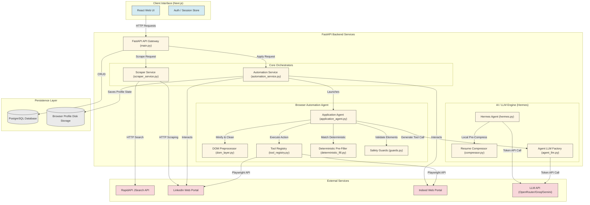
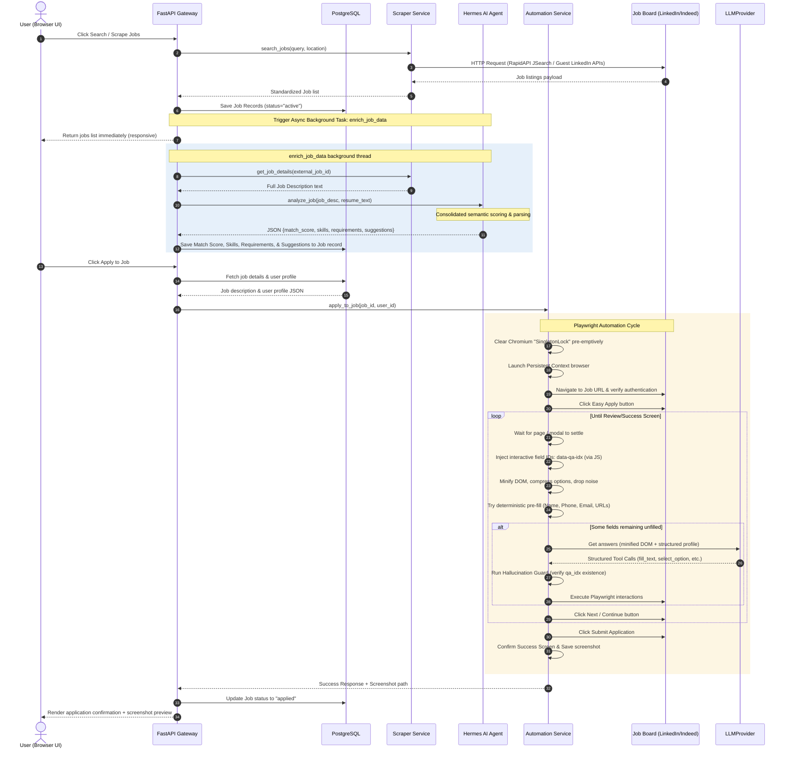

# 📖 Complete System Architecture & Automated Job Application Pipeline Documentation

Welcome to the technical onboarding and system documentation for the **AI Job Automation Platform**. This document is a comprehensive guide to understanding the complete workflow, codebase, AI modules, and automation mechanics of this system. It is designed for new engineers joining the project to fully comprehend the system from scratch.

---

## 🗺️ High-Level System Architecture

The platform is designed around a **service-oriented architecture** with a FastAPI backend, a Next.js frontend, a PostgreSQL database, and an AI-driven Playwright automation layer.

### Architectural Blueprint



---

## ⛓️ Component Interaction Diagram

The sequence diagram below displays the communication path across core modules during a job search and background analysis, followed by an automated browser-apply execution.



---

## 🗃️ Database Schema

The persistence layer relies on PostgreSQL. Four core models are declared in the backend codebase under [app/models](file:///d:/automation/Job%20Applied/backend/app/models/):

### 1. User Model ([user.py](file:///d:/automation/Job%20Applied/backend/app/models/user.py))
This table holds authentication details, contact info, job preferences, and AI-extracted resume details.

| Field | Type | Description |
| :--- | :--- | :--- |
| `id` | Integer | Primary key, indexed. |
| `email` | String | Unique, indexed, login email. |
| `hashed_password` | String | Hashed password. |
| `full_name` | String | Extracted or manual full name. |
| `phone` | String | 10-digit mobile number. |
| `phone_country_code`| String | Dropdown-selected country prefix (e.g. `+91`). |
| `location` | String | Location details. |
| `linkedin_url` | String | LinkedIn profile link. |
| `github_url` | String | GitHub profile link. |
| `portfolio_url` | String | Portfolio website link. |
| `summary` | Text | Professional summary. |
| `skills` | JSON (List) | Extracted skills tags (`["Python", "React"]`). |
| `work_experience` | JSON (List) | Extracted employment history objects. |
| `projects` | JSON (List) | Extracted project objects (name, description, technology stack). |
| `education` | JSON (List) | Extracted academic degree objects. |
| `certifications` | JSON (List) | Extracted certification objects. |
| `languages` | JSON (List) | Language profiles. |
| `total_years_experience`| Integer | Programmatically computed years of work history. |
| `desired_job_titles`| JSON (List) | Job titles targeted by the candidate. |
| `expected_salary` | String | Expected compensation value (validated format). |
| `notice_period` | String | Current notice period duration. |
| `work_authorization`| String | Visa status and work authorization constraints. |
| `willing_to_relocate`| Boolean | Relocation indicator. |
| `questionnaire` | JSON (List) | Screening questions list mapping queries to candidate responses. |
| `created_at` / `updated_at`| DateTime | Audit timestamps. |

### 2. Job Model ([job.py](file:///d:/automation/Job%20Applied/backend/app/models/job.py))
Tracks crawled job specifications, enrichment details, matching stats, and application status.

| Field | Type | Description |
| :--- | :--- | :--- |
| `id` | Integer | Primary key, indexed. |
| `title` | String | Job title, indexed. |
| `company` | String | Employer company, indexed. |
| `location` | String | Job location. |
| `description` | Text | Complete raw text of the job description. |
| `url` | String | Unique direct application link. |
| `source` | String | Scraping origin (e.g., JSearch, LinkedIn). |
| `status` | String | Pipeline status (`active`, `applied`, `closed`). |
| `category` | String | Normalized search query category (lowercased). |
| `skills` | Text | Key skills required, extracted from the job description. |
| `requirements` | Text | Key qualifications extracted from the job description. |
| `match_score` | Integer | Calculated ATS alignment score (0-100). |
| `match_suggestions` | Text | Suggestions to tailor the resume for the role. |
| `tailored_resume` | Text | Customized resume draft for the specific application (JSON formatted metadata). |
| `expires_at` | DateTime | Job posting expiration timestamp. |
| `created_at` | DateTime | Discovery timestamp. |

### 3. Resume Model ([resume.py](file:///d:/automation/Job%20Applied/backend/app/models/resume.py))
Stores physical uploaded resume files, text transcripts, and AI suggestions.

| Field | Type | Description |
| :--- | :--- | :--- |
| `id` | Integer | Primary key, indexed. |
| `user_id` | Integer | Foreign key linking to `users.id`. |
| `name` | String | Uploaded file name. |
| `content` | Text | Extracted plain-text content of the resume. |
| `file_path` | String | Local absolute path where the PDF is stored. |
| `search_suggestions`| Text (JSON string) | AI-generated search term queries for background scraping. |
| `created_at` | DateTime | Upload timestamp. |

---

## 🔍 Codebase Deep Dive & Logical Pipeline Stages

The platform functions through five main stages. Each stage is explained in detail below:

```
[Resume Upload & Enrichment]
            │
            ▼
     [Job Discovery] ◄─── (Background Scrape Suggestion)
            │
            ▼
      [Job Filtering] ◄── (Background ATS Analysis)
            │
            ▼
    [Browser Automation] ◄── (Anti-Bot & Auth Checks)
            │
            ▼
    [Agent Decision Loop] ◄── (Deterministic + LLM Tool Calls)
```

---

### Stage 1: Resume Processing & Profile Enrichment

#### What it does
Receives the user's PDF resume, extracts the text content, saves the file to disk, triggers AI-driven parsing of profile metrics, writes structured profile variables to the User database table, and schedules automated background job scraping.

#### Why it is needed
Manual data entry of a user's career details (education, work history, tech skills, contact details) is slow and prone to errors. Automatic parsing sets up the platform's profile data, which is needed for deterministic and AI-driven form-filling.

#### How it works internally
1. The client sends a multipart file upload request containing the PDF to `/api/v1/resumes/upload` in [resume.py](file:///d:/automation/Job%20Applied/backend/app/routes/resume.py#L149).
2. The endpoint verifies the `.pdf` extension and checks that the file size is under 10MB.
3. The file is saved to the local file system under `uploads/resumes/`.
4. Text is extracted using `PdfReader` from `pypdf`.
5. The extracted text is preprocessed and compressed using `ResumeCompressor.compress_resume` (in [compressor.py](file:///d:/automation/Job%20Applied/backend/app/ai/compressor.py#L320)). This removes boilerplate words, filters generic sentences, and deduplicates content using word-level Jaccard similarity.
6. The compressed text is sent to the LLM via `hermes_agent.extract_profile_data` (in [hermes.py](file:///d:/automation/Job%20Applied/backend/app/ai/hermes.py#L368)) using a structured prompt.
7. The extracted JSON payload is validated:
   - Work experience is checked to isolate personal or academic projects, moving them to the `projects` key.
   - Total experience is programmatically recalculated using Python's `datetime` logic (`calculate_experience_years` in [hermes.py](file:///d:/automation/Job%20Applied/backend/app/ai/hermes.py#L41)) to prevent LLM calculation errors.
   - Email and phone values are verified using regex.
8. The database `users` record is updated with contact fields, skills, work experience, projects, education, and certifications.
9. A background task `scrape_jobs_for_new_resume` is queued using FastAPI's `BackgroundTasks`.

```
[Upload PDF] 
     │
     ▼
[Save to Disk] 
     │
     ▼
[Extract Text via pypdf] 
     │
     ▼
[Compress Text via NLTK/Jaccard]
     │
     ▼
[LLM Call: Structured Parse]
     │
     ▼
[Post-Process JSON: Re-calculate Work Exp & Clean Projects]
     │
     ▼
[Save User Profile to DB] 
     │
     ▼
[Queue Background Scraping]
```

#### Input and Output
- **Input**: Multipart file upload (`.pdf`), User auth token.
- **Output**: JSON representation of the created Resume record (`id`, `name`, `user_id`, `created_at`, etc.).

#### Dependencies and Tools
- `fastapi.UploadFile` for file retrieval.
- `pypdf.PdfReader` for text extraction.
- `nltk` (tokenizers, POS taggers) for sentence extraction.
- `openai.AsyncOpenAI` for API access to OpenRouter/Groq.

#### Benefits
- Reduces user onboarding time from minutes to seconds.
- Cleans and formats unstructured PDF text into structured database records.
- Programs like Jaccard validation prevent redundant data from being stored.

#### Limitations
- Scanned PDF images with no embedded text layers cannot be read (requires OCR tool like Tesseract).
- Multi-column resume layouts can sometimes result in scrambled text extraction.

#### Failure Scenarios
- **Extraction Crash**: Corrupted PDF files cause `PdfReader` to throw parser errors.
- **API Outage**: If Groq or OpenRouter APIs are down, profile enrichment fails. (The system falls back to regex-based heuristics in [hermes.py:L493](file:///d:/automation/Job%20Applied/backend/app/ai/hermes.py#L493) to extract email, phone, and name).

#### Optimization Opportunities
- Run OCR as a fallback for image-only PDFs.
- Store a hash of the PDF file to bypass processing if the same file is uploaded again.

#### Best Practices
- Always clean and format input text before passing it to an LLM.
- Implement programmatic calculations (e.g. date math) on the backend rather than relying on the LLM to compute them.

---

### Stage 2: Job Discovery & Scraping

#### What it does
Searches for job postings on job boards based on target titles or queries, and saves the matching jobs to the database.

#### Why it is needed
Job discovery gathers postings from various platforms into a single database. This allows the system to run matching analysis and auto-apply routines locally.

#### How it works internally
1. The client triggers a search via the GET `/api/v1/jobs/search/` endpoint in [jobs.py](file:///d:/automation/Job%20Applied/backend/app/routes/jobs.py#L184).
2. The service queries the external **JSearch API** via `scraper_service.search_jobs` (in [scraper_service.py](file:///d:/automation/Job%20Applied/backend/app/services/scraper_service.py#L13)) passing parameters like search query, location, and date posted.
3. If the JSearch API call fails or returns empty results, the system falls back to direct guest scraping on LinkedIn using `scraper_service.search_linkedin_guest` (in [scraper_service.py](file:///d:/automation/Job%20Applied/backend/app/services/scraper_service.py#L65)).
4. The guest scraper fetches the public jobs endpoint, parses HTML tags using regex to extract titles, companies, locations, and direct application links, and fetches descriptions concurrently for the top 8 jobs using a `ThreadPoolExecutor`.
5. Returned listings are checked against existing jobs in the database by URL. New jobs are saved with `status="active"`.
6. For each newly saved job, the background task `enrich_job_data` is queued to fetch job details and run ATS matching.

```
[Search Triggered]
        │
        ├──► [Try JSearch API] ──(Success)──┐
        │                                   ▼
        └──► [LinkedIn Guest Scraper] ──► [Format Job Records] ──► [Save New Jobs to DB] ──► [Queue Enrichment]
```

#### Input and Output
- **Input**: Query string (`query`), Location (`location`), date posted parameters.
- **Output**: Array of Job database records.

#### Dependencies and Tools
- `requests` for HTTP requests to external job boards.
- `concurrent.futures.ThreadPoolExecutor` for concurrent job description fetching.
- `urllib.parse` for query serialization.

#### Benefits
- Consolidated job search results across different job boards.
- Automatic fallback mechanisms handle third-party API limits or outages.

#### Limitations
- LinkedIn guest scraping relies on public HTML pages, which are subject to layout changes.
- JSearch API queries consume RapidAPI credits.

#### Failure Scenarios
- **API Key Revocation**: If the RapidAPI key is compromised or disabled, the main search fails, causing the system to fall back to guest scraping.
- **IP Blocking**: Excessive guest scraping requests to LinkedIn from the same IP can trigger rate limits or CAPTCHAs.

#### Optimization Opportunities
- Implement local Redis caching for job search results (e.g., 2-hour TTL) to prevent redundant API calls.
- Cache public HTTP scraping requests using residential proxies.

#### Best Practices
- Implement fallback pathways for external network services.
- Parse external payloads carefully to avoid database insertion errors.

---

### Stage 3: Job Filtering & ATS Analysis

#### What it does
Analyzes the alignment between the candidate's resume and the job description. It calculates an ATS match score and extracts required skills and qualifications in the background.

#### Why it is needed
Automating applications for jobs where the candidate's profile is not a good fit is inefficient. This stage filters out low-match jobs and gives the user feedback on resume alignment.

#### How it works internally
1. The background task `enrich_job_data` runs asynchronously in [jobs.py](file:///d:/automation/Job%20Applied/backend/app/routes/jobs.py#L20).
2. If the job description is not present, it fetches it via `scraper_service.get_job_details`.
3. It retrieves the candidate's latest resume from the database.
4. It calls `hermes_agent.analyze_job(job_desc, resume_content)`.
5. The prompt (in [prompts.py](file:///d:/automation/Job%20Applied/backend/app/ai/prompts.py#L4)) instructs the LLM to output a JSON object containing the `match_score` (0-100), resume tailoring `suggestions`, technical `skills` required, and key job `requirements`.
6. The returned values are saved to the `Job` database record.

```
[Background Thread Started]
            │
            ▼
[Fetch Full Job Description]
            │
            ▼
[Retrieve Latest Resume Content]
            │
            ▼
[LLM Call: Consolidated analyze_job Prompt]
            │
            ▼
[Extract JSON: Score, Skills, Reqs, Suggestions]
            │
            ▼
[Update Job Record in DB]
```

#### Input and Output
- **Input**: Job ID, User ID, Database session factory.
- **Output**: Writes matching metrics directly to the `Job` database record.

#### Dependencies and Tools
- `sqlalchemy.orm.Session` for database queries.
- OpenRouter / Groq / Gemini API client.

#### Benefits
- Consolidated analysis saves tokens by combining scoring and requirement extraction into a single LLM call.
- Background execution prevents API latency from blocking the user interface.

#### Limitations
- The accuracy of the match score depends on the quality of the LLM's semantic analysis.
- Truncating descriptions (to 3,000 characters) to save tokens can sometimes omit key qualifications.

#### Failure Scenarios
- **Missing Resume**: If a user runs a search before uploading a resume, the background task skips semantic matching and runs a basic keyword extraction fallback.
- **JSON Format Error**: If the LLM output cannot be parsed as JSON, the system uses fallback default values to prevent database update failures.

#### Optimization Opportunities
- Use strict JSON schema output formats (e.g., Pydantic schema validation) to guarantee structure compatibility.
- Implement resume tailoring tips that are saved to the database.

#### Best Practices
- Perform heavy processing tasks in background threads.
- Cache AI matching evaluations to avoid redundant processing of the same resume and job description.

---

### Stage 4: Browser Automation & Anti-Bot Handlers

#### What it does
Launches a Playwright browser instance, navigates to the job posting, bypasses anti-bot detection systems, handles authentication cookies, and locates the application button.

#### Why it is needed
Job platforms use anti-bot systems to block automated tools. Proper browser configuration and cookie persistence are necessary to interact with these pages.

#### How it works internally
1. The user triggers an application via the POST `/api/v1/jobs/apply/{job_id}` endpoint in [jobs.py](file:///d:/automation/Job%20Applied/backend/app/routes/jobs.py#L381).
2. The orchestrator calls `automation_service.apply_to_job` in [automation_service.py](file:///d:/automation/Job%20Applied/backend/app/services/automation_service.py#L493).
3. The system checks for and deletes any stale Chromium `SingletonLock` files to prevent startup delays.
4. Playwright launches a Chromium instance in a persistent context (`launch_persistent_context`), loading user data (session cookies and storage state) from `browser_data/`.
5. Arguments like `--disable-blink-features=AutomationControlled` are configured, and a custom user agent is set.
6. The system injects a script to remove the `navigator.webdriver` property.
7. The browser navigates to the job URL.
8. The system detects and dismisses cookie banners, popups, and login overlays using platform-specific handlers (`LinkedInHandler` or `IndeedHandler`).
9. If a CAPTCHA or security challenge is detected, the browser waits up to 50 seconds to allow the user to resolve it manually in headed mode.
10. The handler searches for the apply button (e.g., "Easy Apply" or "Apply now") using selector hierarchies and clicks it.

```
[Apply Request Received]
           │
           ▼
[Clear Stale SingletonLock File]
           │
           ▼
[Launch Persistent Chromium Context]
           │
           ▼
[Inject Webdriver Anti-Bot Bypass Script]
           │
           ▼
[Navigate to Job URL & Dismiss Modals]
           │
           ▼
[CAPTCHA Detection & Manual Bypass Window]
           │
           ▼
[Locate and Click Easy Apply Button]
```

#### Input and Output
- **Input**: Job ID, User ID, Database session.
- **Output**: Returns a JSON status object (`success`, `warning`, `error`) and the path to a screenshot.

#### Dependencies and Tools
- `playwright.async_api` for browser control.
- `psutil` for platform-independent process cleanup.

#### Benefits
- Persistent context reuses active sessions, avoiding the need for repeated logins.
- Anti-bot bypass configurations mimic human browser behavior.
- Clean process termination prevents background process leaks.

#### Limitations
- Headless mode execution increases the chance of triggering security checks on some networks.
- Complex CAPTCHAs can block the automation workflow if manual bypass is not possible.

#### Failure Scenarios
- **Session Expiry**: If the platform session has expired, the automation stops and prompts the user to reconnect their account.
- **Redirect to External Site**: If the apply button redirects to an external site rather than opening an iframe/modal, the automation stops and returns a warning with the external URL.

#### Optimization Opportunities
- Run browser instances in a headless configuration on remote servers, using residential proxies to reduce security checks.
- Build a browser pool to reuse active pages instead of launching a new browser context for each application.

#### Best Practices
- Pre-emptively clear browser lock files before launch.
- Terminate leftover browser processes using native Python libraries (like `psutil`) for cross-platform support.

---

### Stage 5: Agent Decision & Form Filling Loop

#### What it does
Extracts modal inputs, matches them against the user profile, pre-fills standard fields using deterministic rules, uses an LLM tool-calling pattern to answer custom questions, and navigates through the form steps to submit the application.

#### Why it is needed
Job application forms feature a variety of input types, custom questions, and multi-step layouts. A dynamic agent loop is needed to handle these forms.

#### How it works internally
1. Once the application modal is open, the orchestrator instantiates the `ApplicationAgent` in [application_agent.py](file:///d:/automation/Job%20Applied/backend/app/services/automation/agent/application_agent.py).
2. It fetches the candidate's profile data and downloads the resume PDF to a temporary directory.
3. The step execution loop runs up to `MAX_FORM_STEPS` (default: 12) to process form pages:
   - **Observe**: The handler detects the step type (e.g., contact info, resume upload, questions, review, success).
   - **DOM Processing**: The `DOMLayer` (in [dom_layer.py](file:///d:/automation/Job%20Applied/backend/app/services/automation/agent/dom_layer.py)) tags all visible interactive inputs (`input`, `select`, `textarea`) with a sequential `data-qa-idx` attribute. It minifies the HTML, removes unnecessary structural tags, and filters large select dropdowns to save tokens.
   - **Deterministic Fill**: Before calling the LLM, the agent checks the fields against `DETERMINISTIC_FIELD_MAP` in [deterministic_fill.py](file:///d:/automation/Job%20Applied/backend/app/services/automation/agent/deterministic_fill.py). Fields matching patterns for name, email, phone, location, and URLs are filled immediately.
   - **LLM Decisions**: If unfilled fields remain, the agent constructs a prompt with the candidate's profile, screening answers, and the minified HTML, and sends it to the LLM (Gemini or Llama-3 70B).
   - **Tool Execution**: The LLM returns tool calls (e.g., `fill_text`, `select_option`, `click_radio`, `toggle_checkbox`).
   - **Safety Check**: The `HallucinationGuard` (in [guards.py](file:///d:/automation/Job%20Applied/backend/app/services/automation/agent/guards.py)) filters out tool calls referencing invalid `data-qa-idx` numbers. Valid tool calls are executed via `ToolRegistry`.
   - **Verification**: The agent verifies that all required fields are filled. If any remain empty, it runs a retry loop (up to 2 times).
   - **Advance**: The agent clicks the "Next" or "Review" button to advance.
4. On the final "Review" page, the handler unchecks "Follow company" options and clicks the "Submit application" button.
5. The system confirms submission by checking for success elements and saves a screenshot of the confirmation page.

```
[Start Step Loop]
       │
       ▼
[Inject data-qa-idx Attributes] ──► [Minify HTML]
       │
       ▼
[Deterministic Pre-fill] (Zero-token fill)
       │
       ▼
[Are there remaining empty fields?]
       ├──► (No) ──► [Advance Form] ──┐
       │                              ▼
       └──► (Yes) ─► [LLM Tool Call] ─► [Validate: Hallucination Guard] ─► [Execute Tools] ─► [Verify Required Fields] ─► [Advance Form]
```

#### Input and Output
- **Input**: Page or Frame reference, User profile dictionary, resume text transcript.
- **Output**: Submits the application on the target platform and returns a status dictionary.

#### Dependencies and Tools
- `bs4.BeautifulSoup` for HTML parsing and tag extraction.
- LangChain Structured Tool wrappers for LLM tool binding.
- Playwright page interactions.

#### Benefits
- Tagging elements with `data-qa-idx` isolates field mapping from complex CSS selectors, simplifying the LLM's task.
- Deterministic rules handle standard fields, reducing LLM API token usage.
- The hallucination guard prevents execution errors from invalid LLM actions.

#### Limitations
- Highly non-standard interactive widgets (like custom drag-and-drop elements) can be difficult to map.
- If the LLM makes an incorrect choice on a screening question, it could result in an invalid application.

#### Failure Scenarios
- **Stuck Form Loop**: If the page does not advance after clicking the next button, the agent compares DOM hashes across attempts and forces navigation to break out of the loop.
- **Incorrect Submission**: The `SubmitGuard` blocks the agent from sending a "submit" navigation action unless the form is on the final review stage, preventing premature submissions.

#### Optimization Opportunities
- Store successfully submitted questions and answers in a local Question Bank database. This allows the system to resolve repeating screening questions locally using semantic search, bypassing the LLM.
- Use native JSON schema models for LLM tool calling to improve formatting consistency.

#### Best Practices
- Perform input validation and sanitization on both deterministic and LLM-generated form values.
- Clean up temporary files (like downloaded resumes) in a `finally` block.

---

## 🛠️ Module Workflows & Architecture Analysis

Here is a detailed breakdown of the three key modules that drive the system's logic, detailing their purpose, design benefits, and architectural considerations.

### 1. DOM Parser Layer (`DOMLayer`)

#### Purpose
Analyzes the live page DOM, injects index coordinates into interactive elements, minifies HTML structures to reduce token consumption, and verifies application completion.

#### Internal Workflow
1. Locates the active modal container (e.g. `.jobs-easy-apply-modal` or `[role='dialog']`).
2. Iterates through all visible interactive inputs, textareas, and selects.
3. Injects a sequential `data-qa-idx` attribute directly into the live page DOM.
4. Clones the modal DOM and runs optimization routines:
   - Select dropdowns with more than 15 options are filtered to keep only options matching keywords from the user profile, the currently selected option, and a few fallback options.
   - Non-interactive containers (like `div`, `span`, `ul`, `li`) without `data-qa-idx` tags are unwrapped, moving their text content directly to the parent node.
   - Retains only allowed tags (like `input`, `select`, `option`, `textarea`, `label`, `p`, headers) and allowed attributes (`id`, `name`, `type`, `value`, `placeholder`, `data-qa-idx`, etc.).
5. Compresses the cleaned HTML markup into a single line.

#### Data Flow Representation

```
                    ┌──────────────────────────┐
                    │      Live Page DOM       │
                    └────────────┬─────────────┘
                                 │
                                 ▼
                    ┌──────────────────────────┐
                    │    Locate Active Modal   │
                    └────────────┬─────────────┘
                                 │
                                 ▼
                    ┌──────────────────────────┐
                    │ Tag Interactive Elements │
                    │     with data-qa-idx     │
                    └────────────┬─────────────┘
                                 │
                                 ▼
                    ┌──────────────────────────┐
                    │   Filter dropdown opts   │
                    │   matching profile keywords│
                    └────────────┬─────────────┘
                                 │
                                 ▼
                    ┌──────────────────────────┐
                    │  Remove non-interactive  │
                    │    div / span wrappers   │
                    └────────────┬─────────────┘
                                 │
                                 ▼
                    ┌──────────────────────────┐
                    │   Format Minified HTML   │
                    └──────────────────────────┘
```

#### Code Implementation Details
Refer to the implementation in [dom_layer.py](file:///d:/automation/Job%20Applied/backend/app/services/automation/agent/dom_layer.py#L64-L265) for the element-scoped JavaScript valuation used to tag and compress the HTML structure.

#### Advantages & Disadvantages
- **Advantages**: Injects attributes directly into the live page to simplify element targeting; reduces HTML size by up to 80%, lowering LLM token costs.
- **Disadvantages**: Heavy JavaScript execution on the page can sometimes trigger reactivity updates in single-page apps (like React/Vue).

#### Scalability & Production Readiness
This module is production-ready. The option-filtering logic is crucial when dealing with country code selectors or state dropdowns, which would otherwise consume thousands of tokens.

---

### 2. LLM Decision Agent (`ApplicationAgent`)

#### Purpose
Orchestrates the step-by-step form filling process, coordinating deterministic checks, LLM queries, tool execution, and error recovery.

#### Internal Workflow
1. Initializes with the candidate's profile, resume text, and active tool schemas.
2. Checks for a success screen to confirm application submission.
3. Passes visible elements to the deterministic pre-filler to resolve standard inputs.
4. If unfilled inputs remain, it formats the candidate profile and HTML into prompt variables and queries the LLM.
5. Processes returned tool calls through the `HallucinationGuard` and executes them via `ToolRegistry`.
6. Checks for required empty fields. If empty inputs remain, it builds a retry payload and runs another pass.
7. Advances the form using platform-specific navigation methods.

#### Data Flow Representation

```
               ┌───────────────────────────┐
               │    Initialize Agent State   │
               └─────────────┬─────────────┘
                             │
                             ▼
               ┌───────────────────────────┐
               │   Check Success Element   │
               └─────────────┬─────────────┘
                             │
                             ▼
               ┌───────────────────────────┐
               │  Run Deterministic Fill   │
               └─────────────┬─────────────┘
                             │
                             ▼
               ┌───────────────────────────┐
               │    Are all fields filled? │
               └──────┬─────────────┬──────┘
                      │             │
                 (Yes)│             │(No)
                      │             ▼
                      │     ┌───────────────────────────┐
                      │     │  Format prompt variables  │
                      │     └───────────┬───────────────┘
                      │                 │
                      │                 ▼
                      │     ┌───────────────────────────┐
                      │     │    Call LLM & get Tools   │
                      │     └───────────┬───────────────┘
                      │                 │
                      │                 ▼
                      │     ┌───────────────────────────┐
                      │     │  Hallucination Guard Filter│
                      │     └───────────┬───────────────┘
                      │                 │
                      │                 ▼
                      │     ┌───────────────────────────┐
                      │     │    Execute Tool Actions   │
                      │     └───────────┬───────────────┘
                      │                 │
                      │                 ▼
                      │     ┌───────────────────────────┐
                      │     │   Check Required Fields   │
                      │     └───────────┬───────────────┘
                      │                 │
                      │                 ▼
                      │     ┌───────────────────────────┐
                      │     │   Run Retry if Required   │
                      │     └───────────┬───────────────┘
                      │                 │
                      └────────┐┌───────┘
                               ││
                               ▼▼
               ┌───────────────────────────┐
               │    Click Next Navigation  │
               └───────────────────────────┘
```

#### Code Implementation Details
Refer to the code in [application_agent.py](file:///d:/automation/Job%20Applied/backend/app/services/automation/agent/application_agent.py#L63-L229) for the execution loop and retry logic.

#### Advantages & Disadvantages
- **Advantages**: The separation of tool definition and execution simplifies the logic; the retry loop helps recover from missing fields.
- **Disadvantages**: Sequential retries can increase execution time if the LLM repeatedly fails to resolve a field.

#### Scalability & Production Readiness
The agent is highly scalable, but executing the browser automation synchronously within FastAPI requests can block thread execution under heavy loads. Moving this process to an asynchronous task runner like Celery is recommended for production.

---

### 3. Local NLP Resume Preprocessor (`ResumeCompressor`)

#### Purpose
Compresses unstructured resume text locally before passing it to the LLM. It removes boilerplate text, deduplicates sentences, and ranks content by information density.

#### Internal Workflow
1. Reconstructs blocks of text by grouping wrapped lines and bullet points.
2. Sectionizes the text into components (e.g. `HEADER`, `SUMMARY`, `SKILLS`, `EXPERIENCE`, `PROJECTS`, `EDUCATION`, `CERTIFICATIONS`).
3. Cleans each section:
   - **Summary**: Ranks bullet points by noun and number density, keeping only the top 8.
   - **Skills**: Deduplicates terms in comma-separated lists.
   - **Experience**: Tokenizes work descriptions into sentences. It removes sentences containing generic boilerplate verbs (like "worked closely with", "responsible for") that lack proper nouns or numbers, and uses stemmed Jaccard similarity (0.60 threshold) to remove duplicate sentences. It keeps only the top 6 highest-scoring sentences per job.
4. Re-assembles the cleaned sections into a structured text format.

#### Data Flow Representation

```
                    ┌──────────────────────────┐
                    │     Raw Resume Text      │
                    └────────────┬─────────────┘
                                 │
                                 ▼
                    ┌──────────────────────────┐
                    │   Reconstruct Paragraphs │
                    └────────────┬─────────────┘
                                 │
                                 ▼
                    ┌──────────────────────────┐
                    │   Sectionize Document    │
                    └────────────┬─────────────┘
                                 │
                                 ▼
                    ┌──────────────────────────┐
                    │   Filter Boilerplate     │
                    │   using POS tag analysis │
                    └────────────┬─────────────┘
                                 │
                                 ▼
                    ┌──────────────────────────┐
                    │  Jaccard Deduplication   │
                    │  using Stemmer Patterns  │
                    └────────────┬─────────────┘
                                 │
                                 ▼
                    ┌──────────────────────────┐
                    │ Rank and Filter Bullets  │
                    └────────────┬─────────────┘
                                 │
                                 ▼
                    ┌──────────────────────────┐
                    │   Build Compressed Text  │
                    └──────────────────────────┘
```

#### Code Implementation Details
Refer to [compressor.py](file:///d:/automation/Job%20Applied/backend/app/ai/compressor.py#L320-L556) for the implementation details of the parsing and compression pipeline.

#### Advantages & Disadvantages
- **Advantages**: Reduces resume token size by 60-80% before LLM transmission, lowering costs and latency; handles unstructured text without requiring external APIs.
- **Disadvantages**: Requires local NLTK model libraries, which must be loaded into memory at startup.

#### Scalability & Production Readiness
Ready for production. The script includes safe fallbacks that use regex patterns if NLTK libraries fail to load.

---

## 🤖 AI Component Analysis

The platform integrates LLMs to handle unstructured text processing and decision-making on form layouts.

### 1. Why the LLM is Used
- **Semantic Matching**: Evaluates how well a candidate's resume aligns with a job description, matching synonyms and related technologies (e.g. knowing that "FastAPI" aligns with "Python Web Frameworks").
- **Dynamic Form Interpretation**: Maps form labels and layouts (which vary across job boards) to the structured candidate profile.
- **Question-Answering**: Resolves custom screening questions (e.g., "Describe your experience with Kubernetes pipelines") based on the candidate's work history.

### 2. Prompts and Expected Outputs

#### Profile Extraction Prompt
- **Context**: Truncated and compressed resume text.
- **Goal**: Extract contact info, skills, experience, education, and projects.
- **Expected Output**: A structured JSON object matching the profile schema.

#### Job Analysis Prompt
- **Context**: Truncated job description (3,000 chars) and resume content.
- **Goal**: Calculate a match score, extract skills and requirements, and generate suggestions.
- **Expected Output**: A JSON object containing `match_score`, `skills`, `requirements`, and `suggestions`.

#### Form Filling Prompt
- **Context**: Candidate profile parameters, screening answers, and minified HTML.
- **Goal**: Map form elements to profile data and generate tool calls to fill the fields.
- **Expected Output**: LangChain structured tool calls.

### 3. Risk Mitigation & Cost Management

- **Hallucination Risks**: The system can hallucinate field IDs (`data-qa-idx`) or user details not present in the profile.
  - *Mitigation*: The `HallucinationGuard` validates every tool call, rejecting those that reference non-existent elements.
- **Token Consumption**: Raw HTML and large resumes can quickly consume context windows.
  - *Mitigation*: The `DOMLayer` minifies the HTML, and the `ResumeCompressor` reduces the resume size before transmission, lowering token usage.
- **Cost Implications**: Frequent, large LLM queries can lead to high API costs.
  - *Mitigation*: Running deterministic rules first reduces the number of fields the LLM needs to process, saving tokens.
- **Alternative Approaches**: A rules-based parser could map standard fields using regex, but it lacks the flexibility needed to handle custom screening questions or varied form layouts.

---

## 🔍 Automation Engineering System Audit

An audit of the codebase from an automation engineering perspective identified several bottlenecks, risks, and optimization areas.

### Identified Issues

#### 1. Redundant LLM Calls
- **Observation**: During job search enrichment, the system makes three sequential LLM calls: `extract_job_details`, `calculate_match_score`, and `analyze_job`.
- **Impact**: This increases API costs and adds latency to background tasks.
- **Recommendation**: Combine these requests into a single `analyze_job` call that returns the score, requirements, and skills in one payload.

#### 2. Sync Execution of Browser Automation
- **Observation**: The apply endpoint awaits the browser automation run directly within the FastAPI request cycle.
- **Impact**: Because Playwright applications can take 60-90 seconds, this blocks ASGI workers and can lead to client timeouts under concurrent load.
- **Recommendation**: Move the application automation to an asynchronous task runner like Celery.

#### 3. Singleton Lock Delays
- **Observation**: If a browser session crashes, Chromium leaves behind a `SingletonLock` file in the user data directory. The system only attempts to delete this lock after two consecutive launch failures.
- **Impact**: This causes startup delays of up to 30 seconds when recovering from a crash.
- **Recommendation**: Pre-emptively check for and delete the lock file before launching the browser.

#### 4. Non-Cross-Platform Process Termination
- **Observation**: Stale browser processes are cleaned up using a Windows-specific PowerShell command.
- **Impact**: This command fails when run in Linux Docker containers, causing process leaks.
- **Recommendation**: Use Python's native `psutil` library to handle process cleanup across platforms.

---

## 📈 System Optimization Roadmap

The following table outlines the recommended optimizations, categorized by priority:

| Optimization | Target Area | Current Problem | Recommended Solution | Complexity | Priority |
| :--- | :--- | :--- | :--- | :--- | :--- |
| **Consolidate Enrichment Prompts** | AI Engine | Makes three separate LLM calls to analyze matching and extract details. | Merge the prompts into a single `analyze_job` call returning a unified JSON payload. | Low | **High** |
| **Pre-emptive Lock Cleaning** | Playwright | Waits for launch failures before clearing Chromium `SingletonLock` files. | Delete the lock file in the user data directory before starting the browser. | Low | **High** |
| **Cross-Platform Process Cleanup** | Process Control | Uses Windows PowerShell commands to kill stale browser processes, crashing on Linux. | Implement process cleanup using Python's native `psutil` library. | Low | **High** |
| **Asynchronous Task Queue** | Task Runner | Runs long-running browser tasks directly within FastAPI request threads. | Move automation tasks to Celery or use FastAPI's `BackgroundTasks` properly out-of-process. | Medium | **High** |
| **Question-Answer Memory Bank** | AI Engine | Repeatedly queries the LLM for common screening questions. | Cache successfully submitted answers in a database table and search them locally before calling the LLM. | Medium | Medium |
| **Redis Caching Layer** | Performance | Repeatedly queries external search APIs for identical searches. | Cache search results in Redis with a 2-hour TTL. | Medium | Medium |
| **Database Indexing** | Database | Missing indexes on foreign keys in the `Application` and `Resume` tables. | Add database indexes to `user_id` and `job_id` columns. | Low | Medium |

---

## 🚀 Execution Walkthrough & Deployment Recommendations

### End-to-End Walkthrough

#### 1. Initialization
The user logs into the Next.js frontend, navigates to Settings, and clicks "Connect" for LinkedIn or Indeed. This opens a headed browser session where the user completes login. Playwright saves the session cookies and storage state to `browser_data/`.

#### 2. Resume Upload
The user uploads their resume. The system extracts the text, saves the file, and runs the local NLP compressor. The LLM parses the career history, programmatically calculates the years of experience, and saves the profile to the database. It then triggers a background search for matching jobs.

#### 3. Job Search & Scoring
The system fetches jobs from JSearch and LinkedIn. For each job, it runs a background task to fetch the full description, extract requirements, and calculate an ATS match score, updating the database record.

#### 4. Auto-Apply Execution
The user clicks "Apply" on a matching job. The backend downloads the resume, retrieves the user profile, and starts the Playwright browser context.

#### 5. Form Interaction Loop
The browser navigates to the job page and clicks "Easy Apply". The system tags the form fields with `data-qa-idx` attributes. It fills standard fields using deterministic rules, and queries the LLM to resolve custom screening questions, executing the actions via the tool registry.

#### 6. Submission & Verification
The system navigates to the review step, unchecks the "Follow company" box, and clicks submit. It verifies submission by checking for success elements, captures a screenshot, saves the application record, and returns a success response to the user.

---

### Production Deployment Recommendations

- **Browser Dependencies**: Ensure all Playwright browser binaries and system dependencies are installed in the production environment:
  ```bash
  playwright install --with-deps chromium
  ```
- **Process Management**: Run the backend behind a WSGI/ASGI server like Uvicorn, configured with multiple worker processes.
- **Task Delegation**: Offload the browser automation tasks to Celery workers running on separate instances to isolate the web server from browser memory usage.
- **Proxy Configuration**: Use residential proxy rotation for guest scraping to avoid IP blocks and rate limits.
- **Observability**: Implement structured logging and monitor API usage to track token consumption and error rates.
